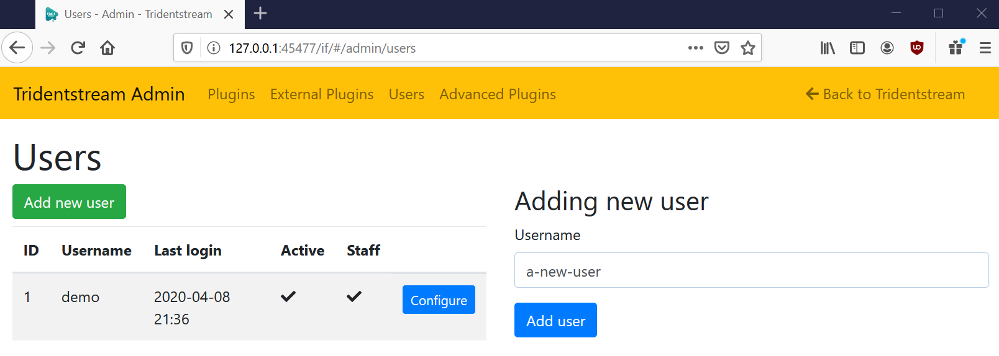
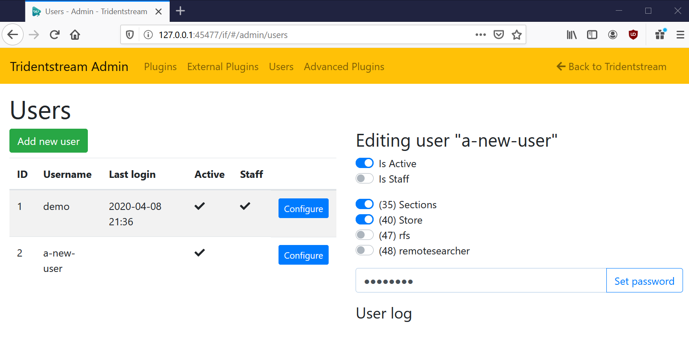

Add a New User
====================================

With a server setup and a plugin added you might want to share your server with other people.

Head over to the admin interface and go under the "Users" tab.

.. _add_new_user:

   Add new user form.

Click the "Add new user" button and enter a name of the new user as
seen in :numref:`add_new_user`. Click the "Add user" button when the name is filled out.

.. _new_user_added:

   Configure user form.

The newly added user does not have a password yet, you can set that in the form seen in
:numref:`new_user_added`. Click "Set password" to set the new password.

Per default a user has access to some services and no access to other services. You can change
what they have access to here by toggling the toggles.
