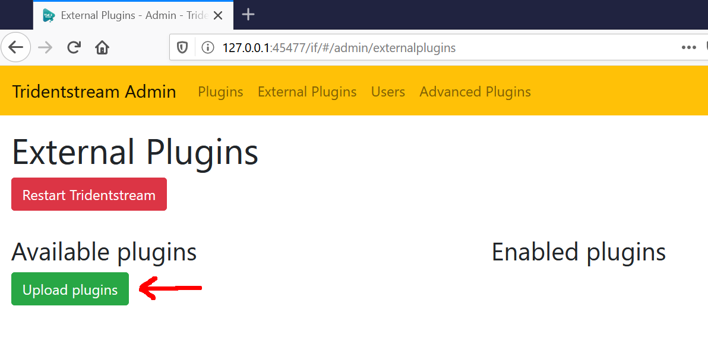
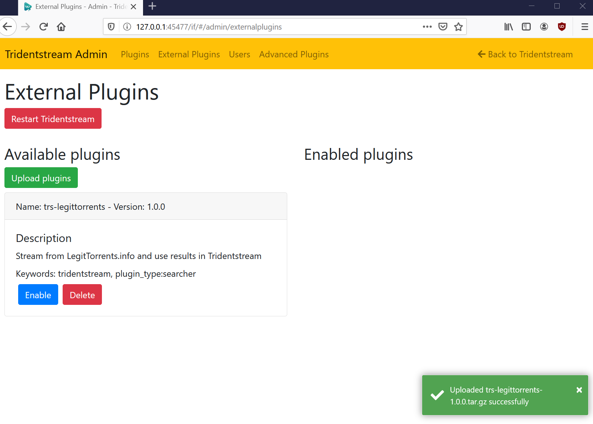
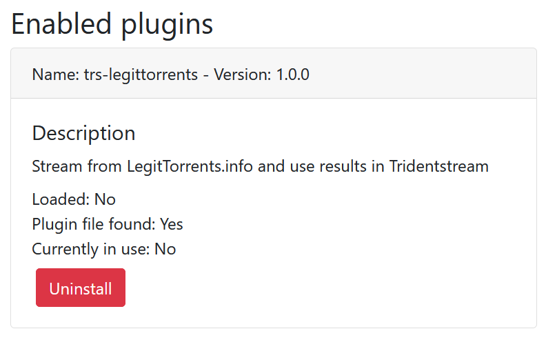
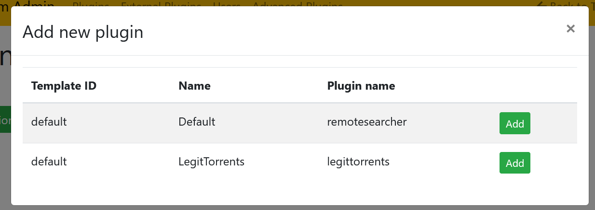
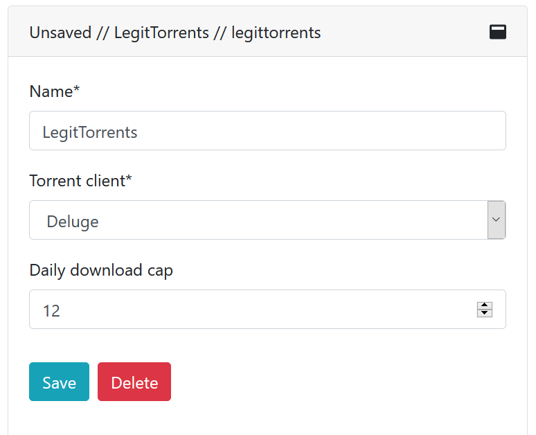
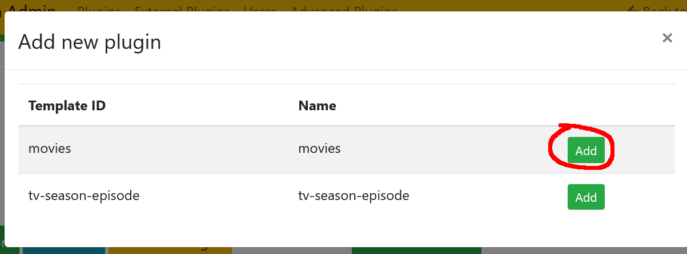
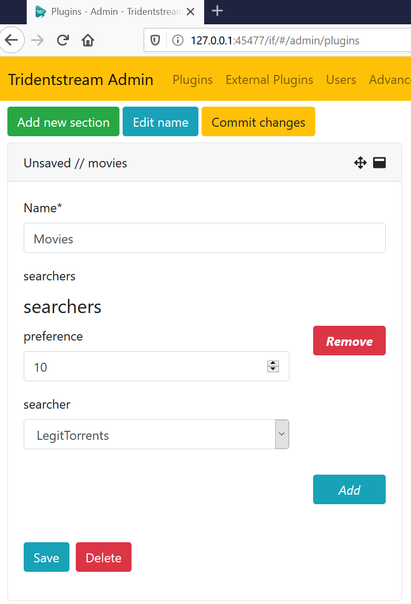
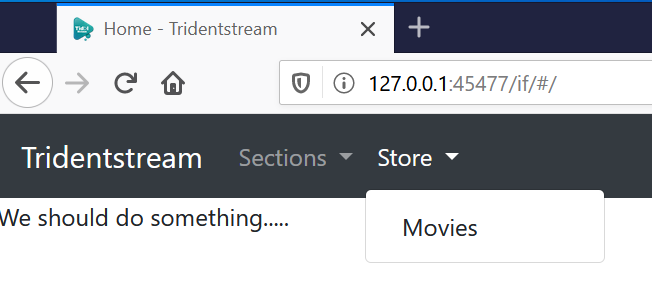

Install an External Plugin and use it
=====================================

This guide will explain how to install an externally acquired plugin that streams torrents
and how to actually use it.

It is assumed you already acquired a plugin you want to install.

Step 1 - Install the Plugin
------------------------------------------------

Head over to the admin page and go to the "External plugin" section.

.. _external_plugins:

   External plugins page

:numref:`external_plugins` shows the external plugin page with no plugins uploaded yet.
Click the "Upload Plugins" button and select the plugin files you want to upload.

.. _plugin_uploaded:

   Plugin uploaded successfully.

:numref:`plugin_uploaded` shows the plugin being successfully uploaded. The uploaded plugin is available in the
"Available plugin" list.

Click the "Enable" button under the plugin, this will make it show up in the "Enabled plugins" list as seen in :numref:`plugin_enabled`.
The text says "Loaded: No" which means that the plugin is not loaded into Tridentstream yet.
This can be solved by clicking "Restart Tridentstream" - the server will restart and load the plugin.

.. _plugin_enabled:

   Plugin enabled successfully.

Step 2 - Add the Plugin
------------------------------------------------

.. _plugin_now_addable:

   Add new searcher popup with LegitTorrents available.

With the plugin loaded we can now use it. Go to the "Plugins" tab and click "Add new searcher".
A popup will appear as seen in :numref:`plugin_now_addable` where you can add your new plugin.
Click "Add" next to the plugin you want to add, in this case LegitTorrents.

.. _configure_legittorrents_plugin:

   Configuration menu for LegitTorrents Plugin.

When adding a new plugin a form appears with all the necessary and optional settings available. A filled out form for LegitTorrent can be seen in :numref:`configure_legittorrents_plugin`. This also relies on the Deluge plugin added in another guide. When done, click "Save".

Step 3 - Link With a Store
------------------------------------------------

.. _add_new_store:

   Add a new store popup.

We now need to link the searcher plugin with a store, click "Add new section" under the "Store". A popup as seen in :numref:`add_new_store` pops up. Since the LegitTorrent plugin can stream movies we need to link it with a "movies" store. Click the "Add" button.

.. _store_config:

   Configure a new store section.

A new section pops up under store and it should be filled out, an example of a filled out form can be seen in :numref:`store_config`.

To get the searcher drop down to popup, click the "add" button. When done, press "Save".
The changes are not yet live, click the "Commit changes" button under "Store" to make the changes live.

Step 4 - Use the New Plugin
------------------------------------------------

.. _store_available:

   The added store is available.

After the changes are committed, the section is available under "Store" on the frontpage as seen in :numref:`store_available`.