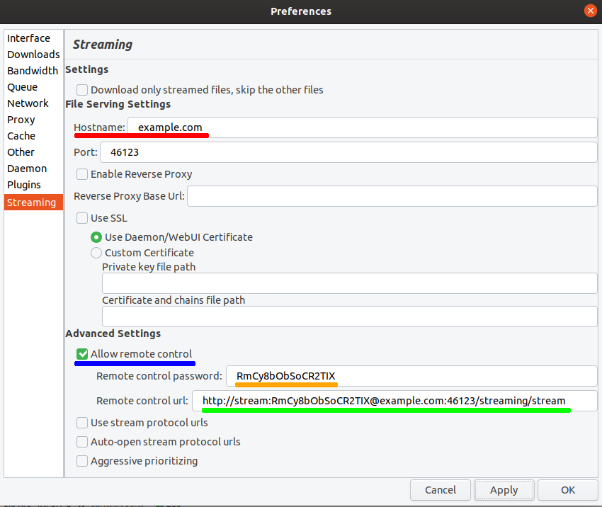
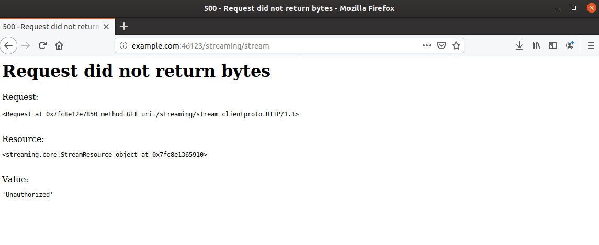
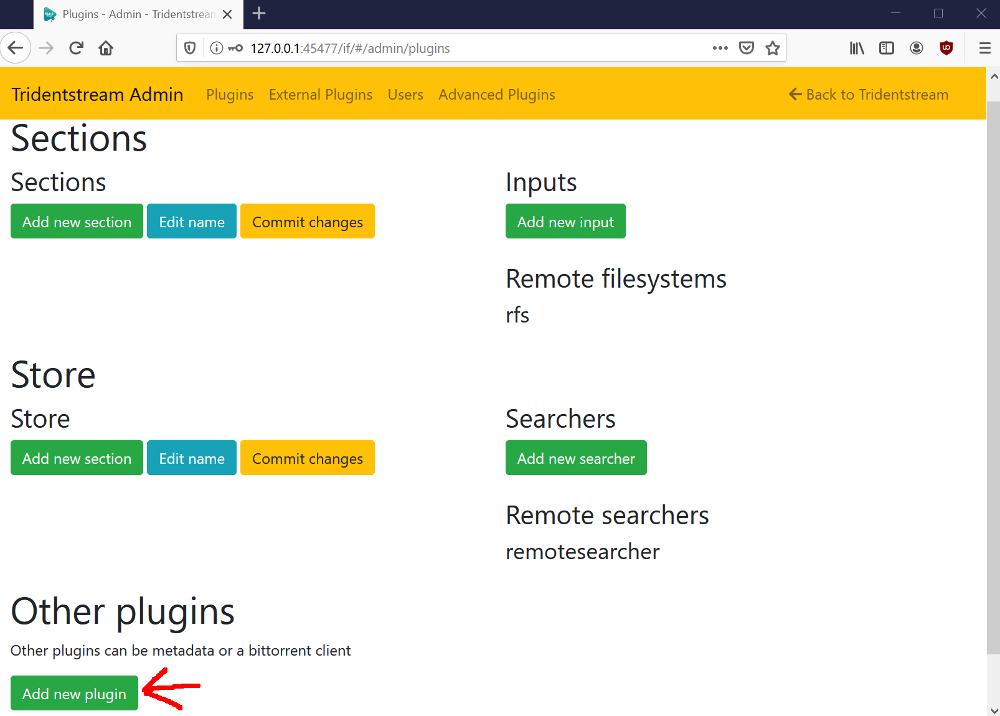
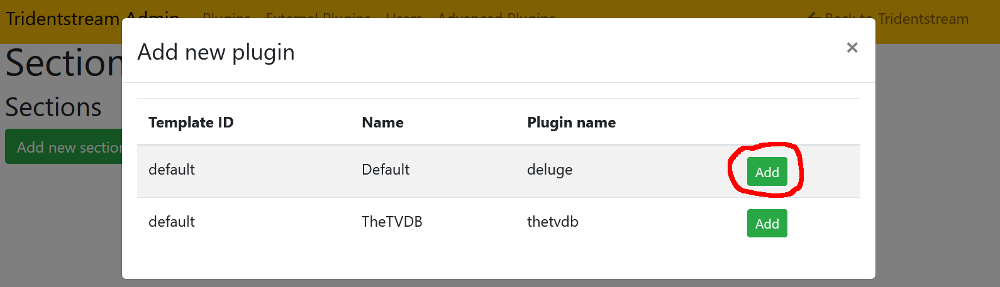
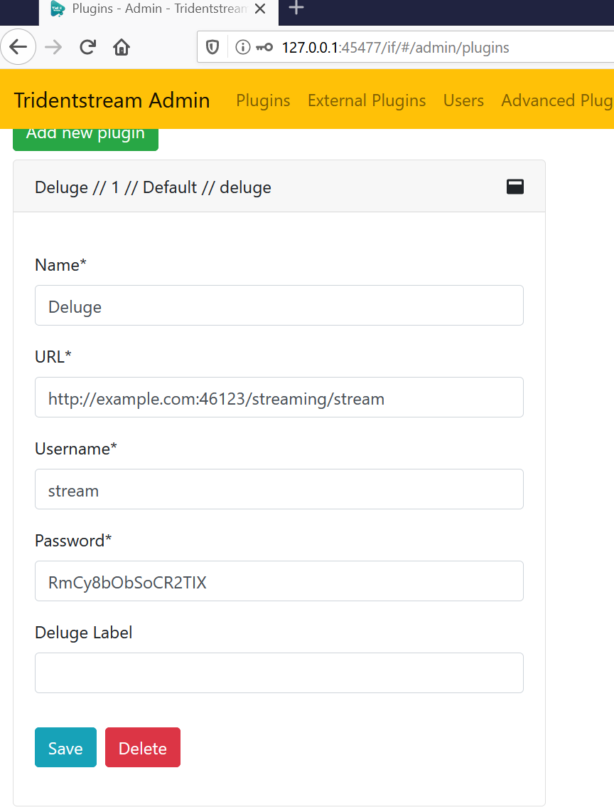

Setup and Use Deluge Streaming
====================================

This guide will show how to setup Deluge Streaming and configure the plugin correctly.
This allows for streaming of torrents via other plugins.

Step 1 - Install Deluge
------------------------------------------------

Installing Deluge is the first thing you need to do, the actual steps to do this is
outside the scope of this guide.

Deluge can be found at https://deluge-torrent.org/

Step 2 - Install Deluge Streaming
------------------------------------------------

The latest release of this plugin can be found `on Github <https://github.com/JohnDoee/deluge-streaming/releases>`_

You can find a plugin installation guide on the `official Deluge Wiki <https://dev.deluge-torrent.org/wiki/Plugins#InstallingPluginEggs>`_

Deluge Streaming should now be installed and enabled.

Please note, some versions of Deluge 2 has a broken plugin system.

Step 3 - Configuring Deluge Streaming
------------------------------------------------

To use Deluge Streaming with Tridentstream the "Allow remote control" needs to be enabled.

.. _deluge_streaming_config:

   Deluge Streaming config.

:numref:`deluge_streaming_config` is the streaming configuration window with all the options changed to be correct.

* The red line is the hostname or IP address where Deluge can be reached.

* The blue line indicates the checkbox that needs to be checked.

* The orange line indicates the password, it is randomly generated and does not need to be changed.

* The green line is the remote control URL, this is needed for Tridentstream

After the correct settings are changed, press apply and test the "Remote control url" (green line).

.. _streaming_working_url:

   Webbrowser trying to open the remote control url directly.

The result from the url should say "Unauthorized" or give an error page similar to the one in :numref:`streaming_working_url`.

Step 4 - Adding the Plugin to Tridentstream
------------------------------------------------

With Deluge Streaming configured, we need to add it to Tridentstream.

First, head over to the "Admin" page under "Plugins" tab.

.. _add_new_plugin:

   Where to add new plugin on the admin interface

On :numref:`add_new_plugin` it is shown where to add the Deluge Streaming plugin on Tridentstream.
Click the highlighted "Add new plugin" button.

.. _add_new_plugin_popup:

   The add new plugin popup

A popup appears as seen in :numref:`add_new_plugin_popup`, click "Add" next to the Deluge plugin.

.. _deluge_plugin_form:

   Filled out Deluge Plugin form

When a new plugin is added, it is in an unsaved stage. Fill it out with your correct information and press "Save".
An example of this can be seen in  :numref:`deluge_plugin_form` which aligns with what we did in step 3.
